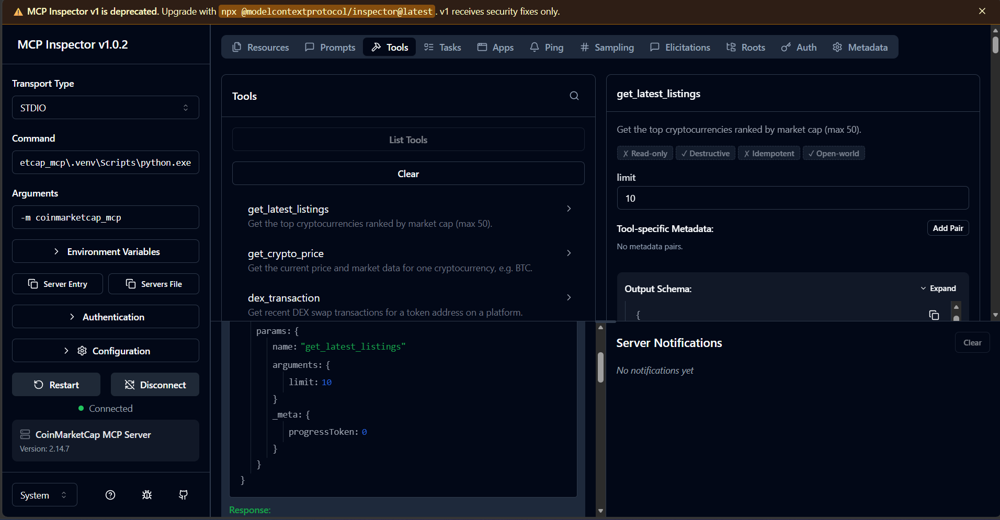

# CoinMarketCap MCP Server

A Python [Model Context Protocol (MCP)](https://modelcontextprotocol.io/) server that lets MCP-compatible clients request cryptocurrency prices, market listings, and decentralized exchange (DEX) data from CoinMarketCap.

Built with **FastMCP 2.x**, **HTTPX**, and **python-dotenv**, using a small, easy-to-follow API helper rather than a custom client lifecycle.

## Features

- Five MCP tools for cryptocurrency and DEX queries.
- Asynchronous HTTP requests with a 10-second timeout.
- API key configuration through environment variables or a local `.env` file.
- Basic input validation and explicit HTTP, connection, and invalid-JSON errors.
- Mocked automated tests that do not consume API credits.
- Local stdio transport for MCP clients and the MCP Inspector.

## Available tools

| Tool | Parameters | Description |
| --- | --- | --- |
| `get_latest_listings` | `limit=10` (1-50) | Fetch top cryptocurrency listings sorted by market capitalization, quoted in USD. |
| `get_crypto_price` | `symbol`, `convert="USD"` | Fetch an asset's price, market cap, percentage changes, and update timestamp. |
| `dex_transaction` | `platform`, `address`, `limit=5` (1-100) | Fetch recent DEX swaps for a token contract address. |
| `list_dex_platforms` | None | List supported platform names and IDs. |
| `get_dex_platform_detail` | `platform_name` | Fetch chain and DEX metadata for a platform. |

DEX access depends on your CoinMarketCap API plan. Check the current [CoinMarketCap API documentation](https://coinmarketcap.com/api/documentation/v1/) for endpoint access, valid parameters, and response schemas.

## Requirements

- Python **3.10 or newer**.
- A CoinMarketCap API key with access to the endpoints you want to use.
- [uv](https://docs.astral.sh/uv/) for the commands below, or Python's `pip`.
- Node.js and npm/npx if you want to use the browser-based MCP Inspector.

## Installation

Open PowerShell in the folder containing this project's `pyproject.toml`. If this project is inside the LangGraph examples folder, first run:

```powershell
cd .\coin_marketcap_mcp
```

Create an environment and install **the project and its development dependencies**, not just `pytest`:

```powershell
uv venv --python 3.12
.\.venv\Scripts\Activate.ps1
uv pip install -e ".[dev]"
```

Alternatively, with Python 3.12 installed:

```powershell
py -3.12 -m venv .venv
.\.venv\Scripts\Activate.ps1
python -m pip install -e ".[dev]"
```

You can also install from the included `requirements.txt` while in this project folder:

```powershell
python -m pip install -r requirements.txt
```

The editable installation makes the `coinmarketcap_mcp` package and the `coinmarketcap-mcp` command available in this environment.

## API key configuration

If you do not already have a `.env` file, copy the example:

```powershell
Copy-Item .env.example .env
notepad .env
```

Set your own API key:

```dotenv
CMC_API_KEY=your_coinmarketcap_api_key
```

You can instead set it for the current PowerShell session:

```powershell
$env:CMC_API_KEY = "your_coinmarketcap_api_key"
```

**Never commit your real key or `.env` file.** The project ignores `.env` in Git. Revoke and replace any key that has been exposed. Environment variables take precedence over values loaded from `.env`.

## Start the server

With the virtual environment activated, run either command:

```powershell
python -m coinmarketcap_mcp
```

```powershell
coinmarketcap-mcp
```

The server starts with **stdio transport** and waits for an MCP client. This is normal: starting the server does not open a web page, fetch prices, or create an HTTP API. Press **Ctrl+C** to stop it.

## Try tools in MCP Inspector

From the project folder, run this instead of starting a separate server:

```powershell
fastmcp dev src\coinmarketcap_mcp\server.py
```

Approve the Inspector package installation if prompted. Open the local URL printed in the terminal and keep the terminal running. Inspector launches the server process when you connect.

If Inspector shows the example command `mcp-server-everything`, replace it with your project's command:

| Inspector field | Value |
| --- | --- |
| Transport | `STDIO` |
| Command | Absolute path to `.venv\Scripts\python.exe` in this project; quote the path if it contains spaces. |
| Arguments | `-m coinmarketcap_mcp` |

To find the executable path in PowerShell:

```powershell
(Get-Item .\.venv\Scripts\python.exe).FullName
```

Click **Connect**, then **Tools > List Tools**. Select `get_crypto_price` and run it with:

```json
{
  "symbol": "BTC",
  "convert": "USD"
}
```

For a listings query, select `get_latest_listings` and use:

```json
{
  "limit": 5
}
```

Results contain live API data; prices vary. Keep Inspector authentication enabled and do not share its session token. If you share a token accidentally, stop and restart Inspector to generate a new one.

For other MCP hosts, configure the same Python executable and module arguments. Supply `CMC_API_KEY` through the host's environment; this avoids relying on the host's working directory to locate `.env`.

## Run tests and lint checks

```powershell
python -m pytest
python -m ruff check .
```

Tests use `httpx.MockTransport` and a fake API key. They check API-key handling, successful requests, error responses, invalid JSON, symbol cleanup, and numeric formatting. They **do not verify live endpoint access or DEX response schemas**.

## Project structure

```text
coin_marketcap_mcp/
|-- src/
|   `-- coinmarketcap_mcp/
|       |-- __init__.py
|       |-- __main__.py       # Module entry point
|       |-- client.py         # API key and HTTP request helper
|       `-- server.py         # MCP tools and input helpers
|-- tests/
|   |-- test_client.py
|   `-- test_server.py
|-- .env.example
|-- .gitignore
|-- requirements.txt
|-- pyproject.toml
`-- README.md
```

A tool receives arguments from the MCP client, validates them, calls `cmc_get`, and formats the API response. Each API call creates and closes its own async HTTP client.

## Troubleshooting

| Symptom | What to do |
| --- | --- |
| `No module named 'coinmarketcap_mcp'` | Activate this project's environment and run `uv pip install -e ".[dev]"`. |
| `Unknown config option: asyncio_mode` | Install the dev extras, which include `pytest-asyncio`. |
| `CMC_API_KEY is not set` | Set the environment variable or create `.env` in the project folder. |
| `spawn mcp-server-everything ENOENT` | Replace Inspector's example command with your environment's Python executable and `-m coinmarketcap_mcp`. |
| `EPIPE` while connecting | Inspect the preceding error: the server process may have failed to launch or exited. Check the command, environment, and API-key configuration. |
| HTTP 401 or 403 | Check API-key validity and whether your API plan allows the endpoint. |
| HTTP 429 | Your quota or rate limit may have been reached; wait and review your plan limits. |
| Server waits after startup | Expected for stdio; connect with an MCP client or Inspector. |
| FastMCP update notice | Keep the project's FastMCP 2.x constraint; avoid upgrading to a different major version without testing compatibility. |

## Limitations

This is a local MCP integration and learning/demo project, not a fully hardened public service. It has no automatic retries, caching, application-level rate limiting, or persistent connections across tool calls. Response validation is basic, and DEX field mappings should be checked against the current API schema before relying on them.

Missing or non-numeric market values are represented as `null`, rather than zero. Market data is informational and is not financial advice.

